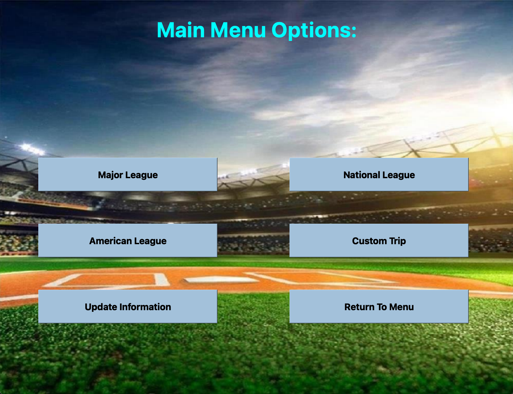
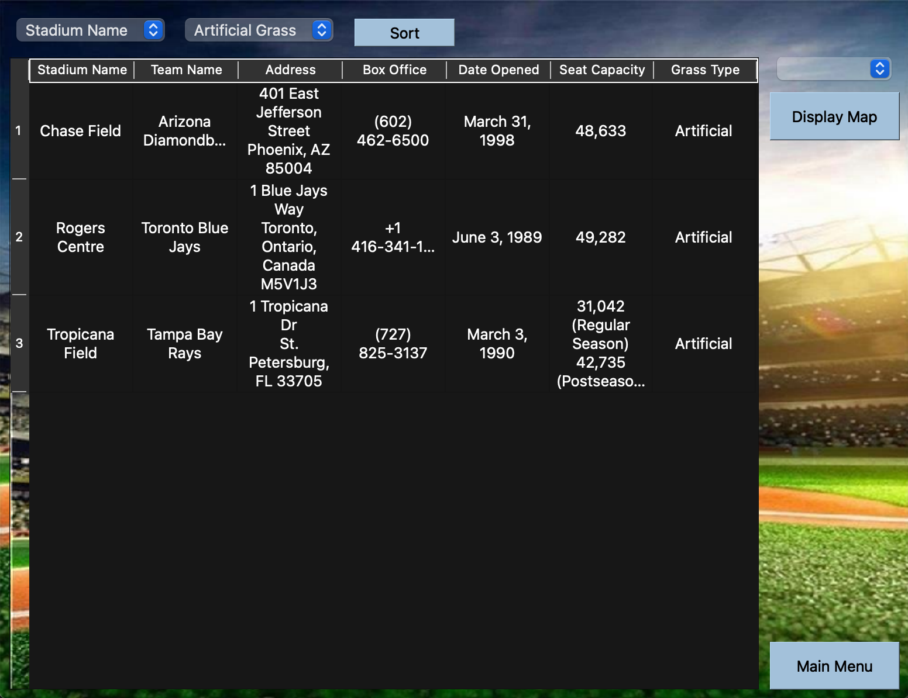
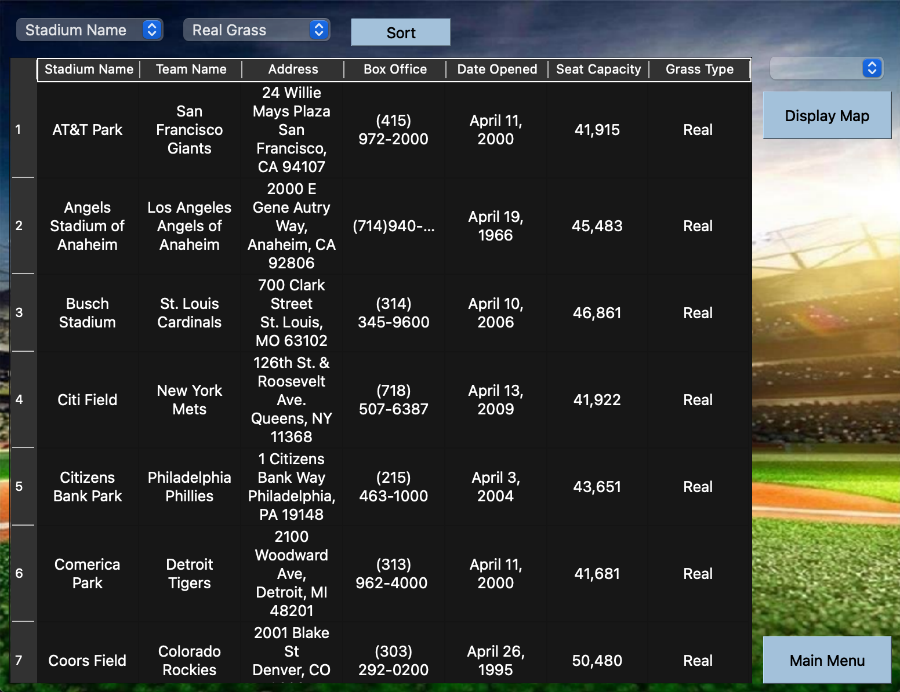
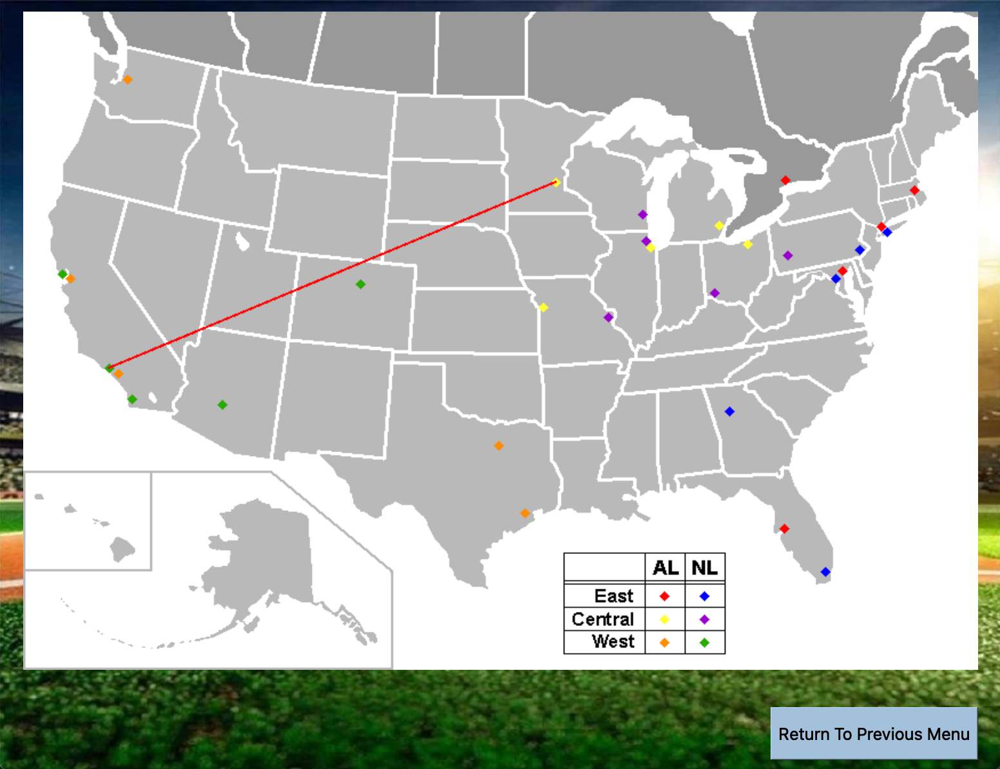

# Baseball Trip Planner
This assignment was the culminating project for our C++ course. The project implements the use of:
  - Reading and Writing to Files
  - Classes, constructors, destructors, pointers 
  - Proper Code Documentation
  - Data Structures &#38; Algorithms

Important Notes:
  - The project was not fully implemented and was graded as a "how much can you get done" type of project.
  - The project required the use of QT Creator widgets and thus the project will not run unless you have QT Creator and its Widgets installed.

## Screenshots
The main page that opens upon running the project. Along with the Main Menu that displays upon clicking the Menu button.
 

 
Screenshots of the read baseball game data sorted according to the users selections made at the top of the GUI
 

 
A planned trip with the shortest path possible indicated by the program generated line from the current location to the stadium of choice
 

