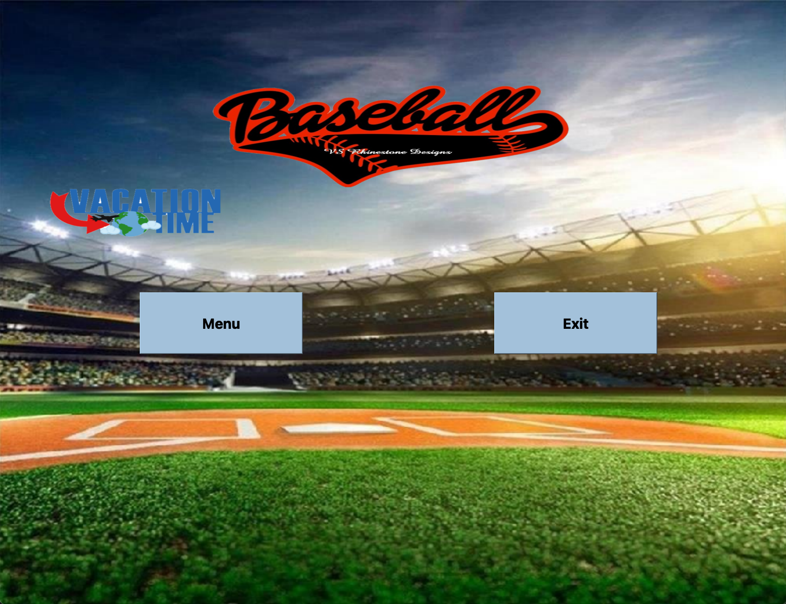

# Baseball
This assignment was the culminating project for our C++ course. It required the use of QT Creator widgets and thus the project will not run unless you have QT Creator and its Widgets installed.

## Screenshots

